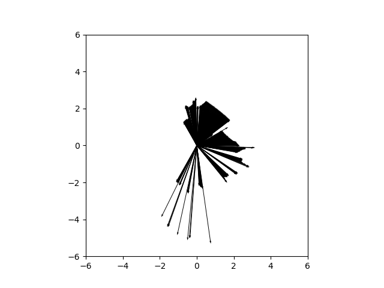
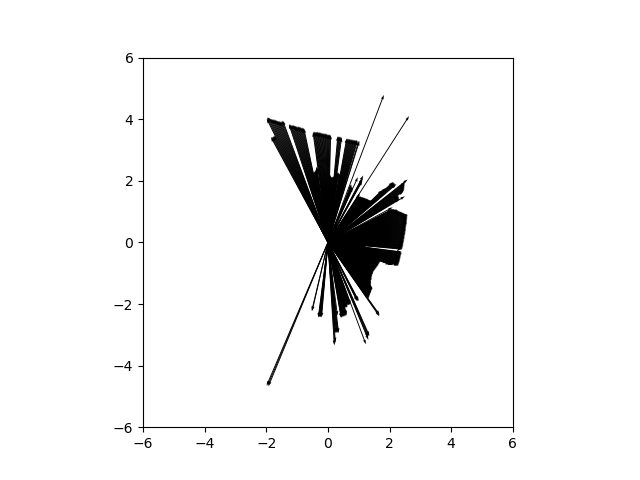

# Report 1

### Authors

- Marcel Skrok
- Mateusz Strembicki

## Topic information

For this task the /pioneer/scan topic was used. Information about the topic:
- Type: sensor_msgs/msg/LaserScan
- Publisher count: 1
- Subscription count: 11

Message fields send by the robot to the topic:

- float32 angle_min            # start angle of the scan [rad]
- float32 angle_max            # end angle of the scan [rad]
- float32 angle_increment      # angular distance between measurements [rad]

- float32 time_increment       # time between measurements [seconds]
- float32 scan_time            # time between scans [seconds]

- float32 range_min            # minimum range value [m]
- float32 range_max            # maximum range value [m]

- float32[] ranges             # range data [m]

- float32[] intensities        # intensity data [device-specific units]. 

The following fields were used: angle_min, angle_increment and ranges.

The frequency of sending messages was about 10Hz. 

## Results

 Below are two samples of the result obtained:

## Conclusions

The main goal of the task was obtained. The data from the LIDAR was succesfully received and plotted.

