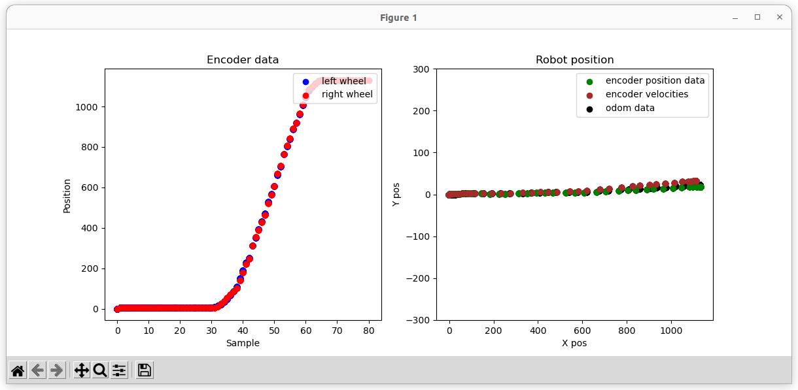
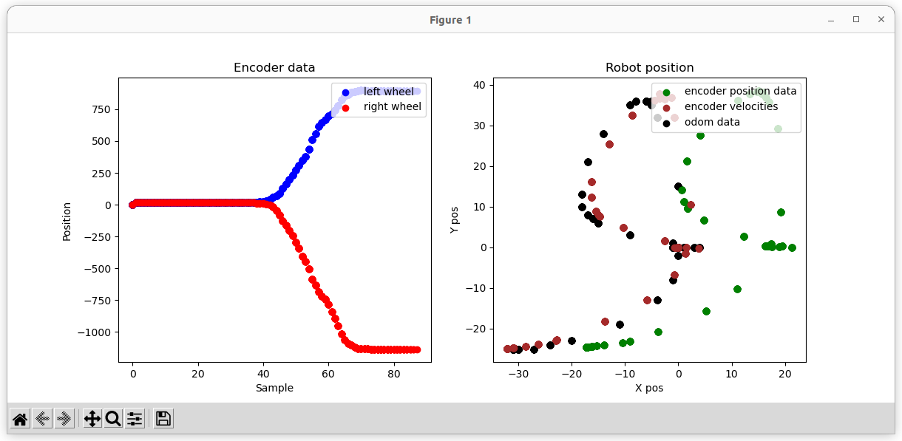
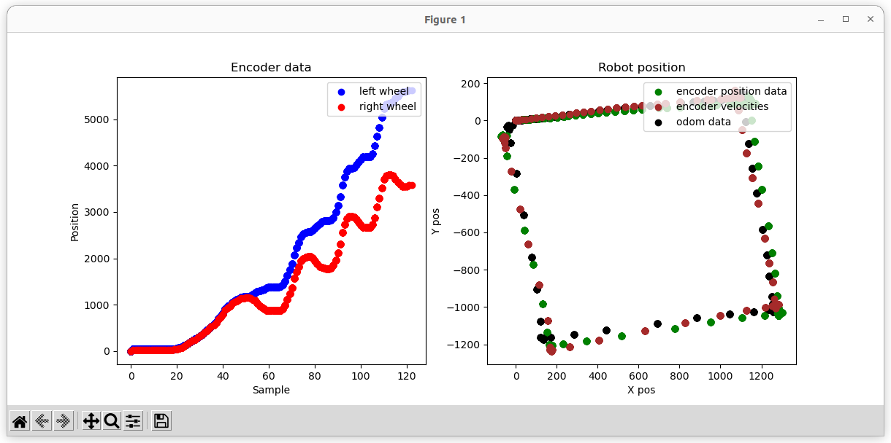

# Report 2

### Authors

- Marcel Skrok
- Mateusz Strembicki

## Formulas

In this excercise we tested how odometry can be measured with encoders and what errors can occure during those measurements. Tests were done for data obtained using position data, as well as the velocity. Then, the results were compared to data obtained with the "odom" topic. 

Calculating robot postion with encoders tics:
- D_l - distance taken by the left wheel
- D_r - distance taken by the right wheel
- D_avg - mean displacement of right and left wheel
- L - distance between wheels
- D - diameter of the wheel
- x, y, theta - postion and orientation angle of the vehicle

Calculations:
- Theta = Theta + (D_r - D_l)/L
- x = x + D_avg*cos(Theta)
- y = y + D_avg*sin(Theta)

## Results

 #### Below are two samples of the result obtained:
 File: Odom_forward

 File: Odom_rot_right

 File: Odom_square_right

## Conclusions

- Encoders can be succesfully used for calculating a robot position and orientation after move or rotation.
- During measurements some errors occured. They are caused by cumulating encoders errors in time. So, it should be correted by combining this method with an absolute odometry method (e.g. beacons)

