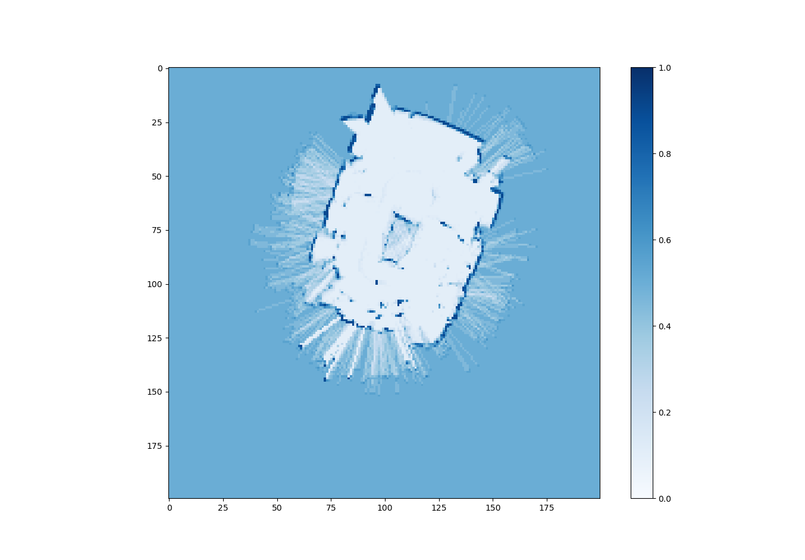

# Report  

### Authors

- Marcel Skrok
- Mateusz Strembicki

## Results

### Alghoritms

#### Probability coefficient algorithm
Was used to determine the probability that sigle cell of the grid is occupied or not. This approach is very similar to this presented during lecture: 
- p - the probability that a cell is occupied
- a - positive coefficient
- b - negative coefficient

If a cell is marked as occupied during scan, the new probability is p_n = p * a up to the maximum value, if as free - p_n = p * b down to minimum value, otherwise p_n = p.

#### Bresenham's line algorithm.
Is a line drawing algorithm that determines the points of an n-dimensional raster that should be selected in order to form a close approximation to a straight line between two points. We used it to determine points of the map that are between the robot and the detected obstacle. 

### Parameters of the alghoritms

Probability coefficient algorithm:
- a - positive value greater that 1, determines how fast a field is marked as occupied
- b - positive value greater that 0 and lower than 1, determines how fast a field is marked as free

### Map

