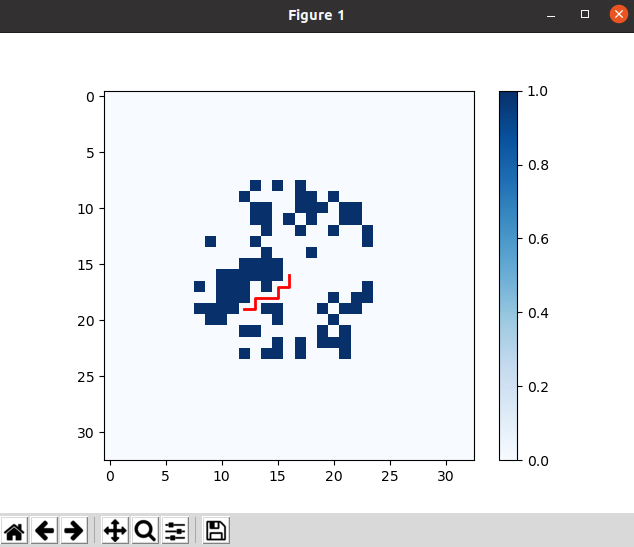
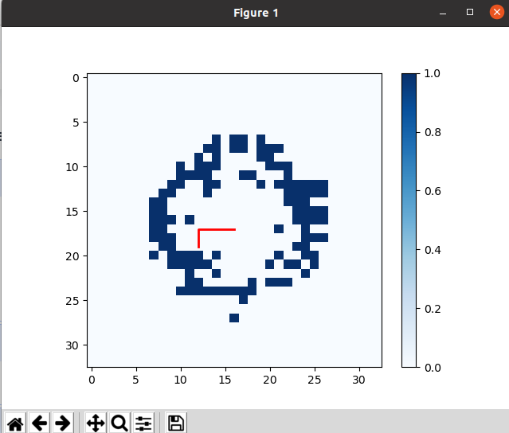

# Report  

### Authors

- Marcel Skrok
- Mateusz Strembicki

## Results

### Path planning with A* algorithm
Finding the best route from one place to another is essential in many fields like robotics, video games, and navigation systems. The A\* algorithm is one of the best methods for this. It efficiently finds the shortest path (in heuristic sense) while balancing speed and accuracy. A\* is a smart search algorithm that finds the shortest route by looking at both the distance traveled and an estimated distance to the goal.

#### Main Components
- Grid Representation - The area is divided into a grid where each cell can either be **walkable (`0`)** or **blocked (`1`)**.
- Heuristic Function - A way to estimate the remaining distance to the goal. Here, we use the **Manhattan distance**, which is calculated as:
  
  ```python
  def heuristic(a, b):
      return abs(a[0] - b[0]) + abs(a[1] - b[1])
  ```

- Cost Calculation:
  - `g(n)`: The actual distance traveled so far.
  - `h(n)`: The estimated distance to the goal.
  - `f(n) = g(n) + h(n)`: The total estimated cost.

#### Steps of the Algorithm
1. Create an **open list** (nodes to check) and a **closed set** (already checked nodes).
2. Start by adding the **starting position** to the open list.
3. Repeat while there are nodes in the open list:
   - Pick the node with the **lowest `f(n)`** value.
   - If it's the **goal**, trace back the path and return it.
   - Otherwise, move it to the closed set.
   - Check its **neighbors** (up, down, left, right), update their costs, and mark the best path.
4. If there’s no possible path, return `None`.

#### Handling Obstacles Dynamically
If an obstacle appears along the calculated path, the algorithm detects it and re-runs A\* from the last valid position.

```python
if grid[x][y] == 1:
    print(f"Obstacle encountered at {x, y}")
    return a_star_search(grid, path[i-1], end)
```
#### Founded Path



#### Path replaning while moving




### Motion controller
Two sets of robot state are defined: current and set. When MoveForward(distance) or Rotate(angle) functions is fired, set value is changed. Robot checks in a loop if difference between current and set vaules is less than acceptable error. If not, it slightly moves or rotate the robot to minimize the error.

### Navigation
Robot takes a single step as moving from one mesh point to the next point determined by path plannig agorithm or by rotating by 90 degrees left or right. The map is updated with every lidar scan, and then the path is replanned. The robot's navigation in this code relies on odometry and a laser scanner to determine its position in space.

#### Odometry
- The robot reads its position (x, y) and orientation (angle) from the `Odometry` message.
- The robot's orientation angle is calculated from the quaternion (from the odometry message).
- Based on the odometry, the robot calculates its current position on the map by adding the changes in position to the initial starting position.

```python
self.robotPosition[0] = self.robotStartPosition[0] + int(x_curr * self.scalingFactor)
self.robotPosition[1] = self.robotStartPosition[1] + int(y_curr * self.scalingFactor)
self.robotOrientation = theta_curr
```

#### Scaling and Position Update
The robot's position on the map is transformed into the map's coordinate system using the `scalingFactor`, which converts odometry units into map units.

#### Map Integration
The robot's position is updated on the map, allowing its location to be tracked in real-time.


## Conclusions
The aim of our approch was to determine robot position using odometry, which tracks its movement, and the laser scanner, which helps with orientation on the map. Everything should be updated in real-time, allowing the robot to know where it is.
Summing up, we had problems with motion execution. Robot correctly determined and update the path, but it did not excecute it correctly. We were not able to determine why during the labolatories.
